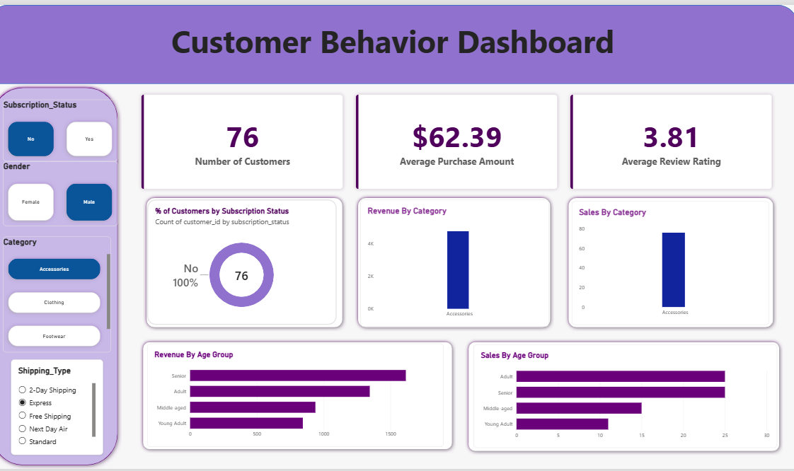

# 🛍️ Customer Shopping Behavior Analysis

An end-to-end **Data Analytics project** that analyzes customer shopping behaviour, purchasing patterns, customer demographics, and sales performance using **Python, Pandas, SQL, PostgreSQL, and Power BI**.

---

## 📌 Project Overview

The objective of this project is to analyze customer shopping data and generate meaningful business insights that can help organizations understand their customers and improve decision-making.

The project follows a complete data analytics workflow:

**Data Collection → Data Cleaning → Exploratory Data Analysis → SQL Analysis → Data Visualization → Business Insights**

Python and Pandas were used for data cleaning and exploratory analysis, SQL was used for business-level analysis, and Power BI was used to create an interactive dashboard.

---

## 🎯 Business Problem

Businesses generate large amounts of customer transaction data, but raw data alone does not provide meaningful insights.

This project focuses on understanding:

* Customer purchasing behaviour
* Product category performance
* Customer spending patterns
* Customer demographics
* Purchase trends
* Revenue contribution
* High-value customers

The analysis helps transform raw customer data into actionable business insights.

---

## 🎯 Project Objectives

* Clean and preprocess the customer shopping dataset.
* Perform Exploratory Data Analysis (EDA).
* Analyze customer behaviour using Python and Pandas.
* Perform business analysis using SQL.
* Store and query data using PostgreSQL.
* Create an interactive Power BI dashboard.
* Identify important trends and patterns.
* Generate useful business insights for decision-making.

---

# 🛠️ Technologies & Tools

| Technology          | Purpose                             |
| ------------------- | ----------------------------------- |
| 🐍 Python           | Data analysis and preprocessing     |
| 🐼 Pandas           | Data cleaning and EDA               |
| 🔢 NumPy            | Numerical operations                |
| 🗄️ PostgreSQL      | Database management                 |
| 💻 SQL              | Business analysis                   |
| 📊 Power BI         | Dashboard and data visualization    |
| 📓 Jupyter Notebook | Python analysis                     |
| 🐙 GitHub           | Version control and project hosting |

---

# 📂 Project Structure

```text
Customer-Behavior-Analysis/
│
├── 📄 Business Problem Document.pdf
│
├── 📄 Customer Shopping Behavior Analysis.pdf
│
├── 📊 Customer_Behavior_Dashboard.pbix
│
├── 💻 Customer_behavior_analysis.sql
│
├── 🖼️ Customer_behavior_dashboard.png
│
├── 📓 Customer_shopping_behaviour_analysis.ipynb
│
├── 📄 README.md
│
└── 📊 customer_shopping_behavior.csv
```

---

# 🔄 Project Workflow

```text
                Customer Dataset
                       │
                       ▼
              Data Cleaning
                       │
                       ▼
             Python & Pandas
                       │
                       ▼
          Exploratory Data Analysis
                       │
                       ▼
             PostgreSQL + SQL
                       │
                       ▼
              Business Analysis
                       │
                       ▼
                 Power BI
                       │
                       ▼
          Interactive Dashboard
                       │
                       ▼
             Business Insights
```

---

# 🐍 1. Python & Pandas Analysis

The file:

```text
Customer_shopping_behaviour_analysis.ipynb
```

contains the Python-based data analysis.

Python and Pandas were used for:

* Data loading
* Data inspection
* Data cleaning
* Missing-value analysis
* Duplicate-value checking
* Data transformation
* Exploratory Data Analysis
* Grouping and aggregation
* Customer behaviour analysis

### Import Libraries

```python
import pandas as pd
import numpy as np
```

### Load Dataset

```python
df = pd.read_csv("customer_shopping_behavior.csv")

df.head()
```

### Check Dataset Information

```python
df.info()
```

### Check Missing Values

```python
df.isnull().sum()
```

### Check Duplicate Records

```python
df.duplicated().sum()
```

### Statistical Summary

```python
df.describe()
```

### Category Analysis

```python
df["category"].value_counts()
```

### Total Purchase Amount by Category

```python
df.groupby("category")["purchase_amount"].sum().sort_values(
    ascending=False
)
```

### Average Purchase Amount by Category

```python
df.groupby("category")["purchase_amount"].mean().sort_values(
    ascending=False
)
```

These Pandas operations were used to identify customer purchasing patterns and category-level performance.

---

# 💻 2. SQL Analysis

The file:

```text
Customer_behavior_analysis.sql
```

contains SQL queries used for business analysis.

SQL was used to analyze customer data and answer important business questions.

### Total Revenue

```sql
SELECT 
    SUM(purchase_amount) AS total_revenue
FROM customer_shopping_behavior;
```

### Average Purchase Amount

```sql
SELECT 
    AVG(purchase_amount) AS average_purchase_amount
FROM customer_shopping_behavior;
```

### Category-wise Revenue

```sql
SELECT 
    category,
    SUM(purchase_amount) AS total_revenue
FROM customer_shopping_behavior
GROUP BY category
ORDER BY total_revenue DESC;
```

### Customer Count by Category

```sql
SELECT 
    category,
    COUNT(*) AS customer_count
FROM customer_shopping_behavior
GROUP BY category
ORDER BY customer_count DESC;
```

### Top Customers by Purchase Amount

```sql
SELECT 
    customer_id,
    name,
    purchase_amount
FROM customer_shopping_behavior
ORDER BY purchase_amount DESC
LIMIT 10;
```

SQL analysis helped convert raw transactional data into meaningful business information.

---

# 🗄️ 3. PostgreSQL

PostgreSQL was used to store and query the customer shopping dataset.

### Database Workflow

```text
customer_shopping_behavior.csv
            ↓
       PostgreSQL
            ↓
      SQL Queries
            ↓
    Business Insights
```

The data was loaded into PostgreSQL and analyzed using SQL queries for customer and purchase analysis.

---

# 📊 4. Power BI Dashboard

The Power BI dashboard was created to provide an interactive visual representation of customer shopping behaviour.

### Dashboard File

```text
Customer_Behavior_Dashboard.pbix
```

### Dashboard Preview



---

## 📈 Dashboard Features

The dashboard provides insights into:

* 💰 Revenue Performance
* 👥 Customer Analysis
* 🛍️ Product Category Performance
* 💵 Purchase Amount
* 👤 Customer Demographics
* 📊 Customer Shopping Behaviour
* 🔎 Interactive Filtering
* 📌 KPI Metrics
* 📈 Data Trends

The dashboard helps users quickly understand important patterns and make data-driven business decisions.

> **Note:** The `.pbix` file can be opened using **Microsoft Power BI Desktop**.

---

# 💡 Key Business Insights

The analysis helps identify:

* Which product categories perform better.
* Customer purchasing and spending patterns.
* Differences in customer behaviour across demographics.
* High-value customers based on purchase amount.
* Category-wise revenue contribution.
* Popular customer purchasing segments.
* Opportunities for targeted marketing and customer retention.

---

# 📈 Business Value

The project demonstrates how data analytics can help businesses make better decisions.

### Business Benefits

✅ Understand customer preferences
✅ Identify high-value customers
✅ Analyze category performance
✅ Improve marketing strategies
✅ Understand purchasing patterns
✅ Support customer retention
✅ Make data-driven business decisions

---

# 🧠 Skills Demonstrated

### Python & Pandas

* Data Cleaning
* Data Preprocessing
* Exploratory Data Analysis
* Data Manipulation
* GroupBy
* Filtering
* Sorting
* Aggregation

### SQL

* SELECT
* WHERE
* GROUP BY
* ORDER BY
* Aggregate Functions
* Business Analysis Queries

### PostgreSQL

* Database Management
* Data Import
* SQL Querying
* Data Analysis

### Power BI

* Data Visualization
* Dashboard Development
* KPI Cards
* Charts
* Slicers
* Interactive Reports
* Business Intelligence

### Data Analytics

* Data Cleaning
* EDA
* Customer Behaviour Analysis
* Business Problem Solving
* Data-Driven Decision Making

---

# 📁 Project Files

| File                                         | Description                               |
| -------------------------------------------- | ----------------------------------------- |
| `Business Problem Document.pdf`              | Business problem and project requirements |
| `Customer Shopping Behavior Analysis.pdf`    | Detailed project report                   |
| `Customer_Behavior_Dashboard.pbix`           | Interactive Power BI dashboard            |
| `Customer_behavior_analysis.sql`             | SQL business analysis queries             |
| `Customer_behavior_dashboard.png`            | Power BI dashboard preview                |
| `Customer_shopping_behaviour_analysis.ipynb` | Python and Pandas analysis                |
| `customer_shopping_behavior.csv`             | Customer shopping dataset                 |
| `README.md`                                  | Project documentation                     |

---

# 🚀 How to Run the Project

## Step 1: Clone the Repository

```bash
git clone https://github.com/priyankagargpandey/Customer-Behavior-Analysis.git
```

## Step 2: Install Python Libraries

```bash
pip install pandas numpy sqlalchemy psycopg2-binary jupyter
```

## Step 3: Open Jupyter Notebook

Open:

```text
Customer_shopping_behaviour_analysis.ipynb
```

Run the notebook cells to perform data cleaning and exploratory analysis.

## Step 4: Perform SQL Analysis

Open:

```text
Customer_behavior_analysis.sql
```

Run the SQL queries in PostgreSQL or pgAdmin.

## Step 5: Open Power BI Dashboard

Open:

```text
Customer_Behavior_Dashboard.pbix
```

using Microsoft Power BI Desktop.

---

# 📌 Project Highlights

```text
🐍 Python + Pandas
        ↓
🧹 Data Cleaning
        ↓
📊 Exploratory Data Analysis
        ↓
🗄️ PostgreSQL
        ↓
💻 SQL Analysis
        ↓
📈 Power BI Dashboard
        ↓
💡 Business Insights
```

This project demonstrates a complete **end-to-end Data Analytics workflow**, from raw customer data to an interactive business intelligence dashboard.

---


